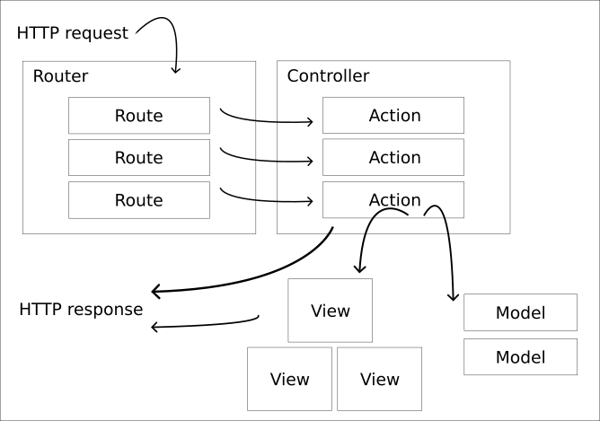

# README för MVC

## Hur man klonar report
Github har en bra guide på hur man klonar en repository!

[Github Docs](https://www.example.com)
1. On GitHub.com, navigate to the main page of the repository.
2. Above the list of files, click  Code.
3. Copy the URL for the repository.
4. Open Git Bash.
5. Change the current working directory to the location where you want the cloned directory.
6. Type `git clone`, and then paste the URL you copied earlier.
`git clone https://github.com/YOUR-USERNAME/YOUR-REPOSITORY
`
7. Press Enter to create your local clone.

## Hur man kommer igång med webbplatsen
Skriv `php -S localhost:8888 -t public` i terminalen.